# Doxer Stylometric Data Mining Library 🕵️


## Introduction

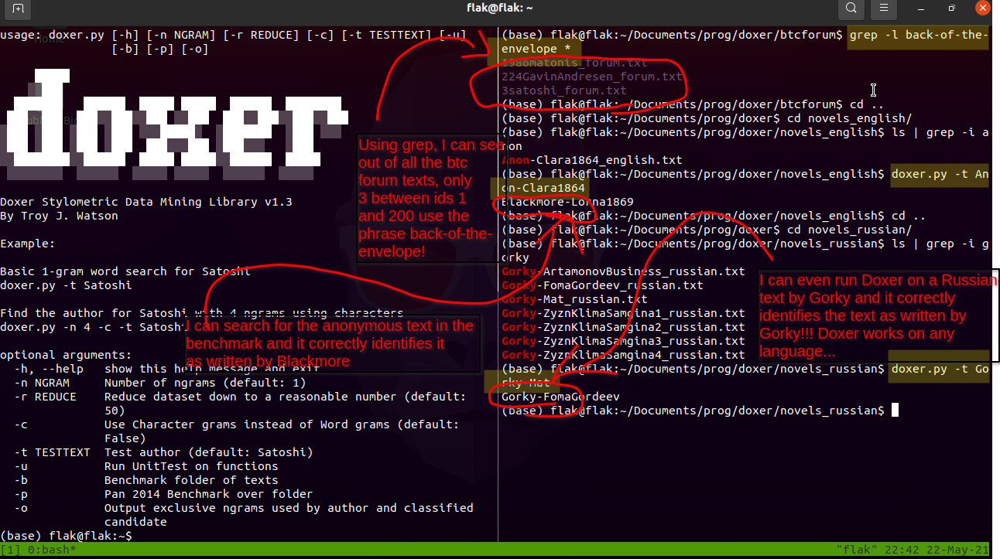

Let us start this research project with a quick word about Agatha Christie (as pictured in the quote above). I have always likened my work as a data miner to that of Christie's most famous character Miss Marple. Far from being a lone spinster, Miss Marple is able to outwit some of the most clever of criminals simply because she has read enough crime books to gain a somewhat sixth sense into their goings on. With that I will encourage you to take my argument seriously and to even install my software on your own computer. The Python library after all is self contained and needs not many extra imports. With that said, let's uncover the identity of Satoshi and maybe learn a few more lessons about data mining along the way. 

What I wanted more than anything else is a stylometry program that could run easily from my Linux terminal and gather robust stylometric results without the need for a GPU. I lay feverishly in my bed trying to solve this problem while also surviving a cold. I came up with an algorithm that when I awoke immediately translated into code so as to solve most of this problem once and for all. 

If you pay attention to the above diagram, you will see that Doxer is able to find the identity of the famous Russian writer Gorky by simply typing `doxer.py -t Gorky-Mat` The result is an immediate match without much work being put into it. The algorithm thus is unsupervised and also can work anywhere on terminal if you add it to your `.bashrc` file. 

And by way of embarrassment I admit that I made a typo in the image above, writing 200 instead of 2,000. I analyzed all substantial texts between 1 and 2,000 on the bitcoin forum, adding an extra Adam Back just for the fans of his authorship. 

Moving on to another line in the diagram above, you can see Doxer identifying a text labeled as Anon-Clara1864. This file-name means that it is titled Clara and was published in 1864. Doxer immediately uncovers the author's identity and correctly attributes Blackmore as the culprit. Here is the wiki page about the book which you can check for yourself: 

https://en.wikipedia.org/wiki/Clara_Vaughan


This program can be used for a multitude of stylometry tasks, but I will contain the scope of this case study to the mystery of Satoshi Nakamoto, the inventor of Bitcoin. I will use Doxer to finalize my analysis but I will additionally employ a Random Forest on an Amazon EC2 instance to reduce the list of candidates down to a manageable (yet reasonable) amount. 

In a short word, Doxer is a unique word analyzer which takes upon itself the task of finding all of the unique words that two texts share. You first take an unknown text and compare it one by one with all of the other possible candidate texts. Slowly but surely you count how many times each candidate text shares a word with only the unknown text. For example, the texts by Satoshi and Gavin may use particular words (or ngrams) that no other text in the corpus uses. If this number divided by the average-overlap-between Gavin-and-all-other-texts is highest among all candidates then it would be reasonable to suggest that out of those candidates the most likely author is Gavin himself. Of course, the algorithm will not work as well if you feed it a million texts because the overlap of words will be dispersed over the entire corpus. It is therefore necessary to reduce the corpus first so as to only analyze those texts that are already similar in style to the unknown text. 

Let's give you a quick toy example. Let's imagine for a moment that Satoshi used 50 words that only Gavin and himself shared. Then let's say that Gavin shared 20 words only with Craig, 20 words only with Hal, and yet again 20 words only with Adam Back. The Doxer score would thus be 50 / ( (20 + 20 + 20) / 3 ) leaving us with a final Satoshi-Gavin score of 50 / 20. As you can see in this toy-example, Gavin shares more unique words with Satoshi than anyone else. We then proceed to repeat this process on every single one of the candidate texts and classify the highest score as Satoshi Nakamoto himself. 

Additionally, I've added a nifty feature with the -o switch that allows you to print out the words that the winner share with the unknown text. Of course when I conducted a one word gram (default setting) with the Bitcoin forum, I found that the winner Gavin Andresen shared an odd phrase of 'back-of-the-envelope' only with Satoshi. As you can see, Doxer leaves punctuation intact and tries to retain as much information as possible so as to find intricate results. 

And to overcome the problem of dispersion mentioned earlier, Doxer runs a quick Burrows' Delta to find the nearest neighbors of the query text. The list of top deltas can then be cut down to a predetermined amount. You may use the -r input with a specified number afterwards. For example `doxer.py -t 3satoshi -r 3` will cut the dataset of over 600 texts down to the nearest 3 texts so as to find more interesting unique words between these likely authors. Keep in mind that the Burrows Delta measure does not currently  include z-scores in the current program because I actually created a Random Forest to act as a reduce() function for the algorithm. Such was undertaken so as to get the best result possible. The amazing thing about the Random Forest is that it has the ability to reject all candidates so that Doxer's job doesn't have to deal with rubbish texts. I found this most useful when analyzing the Bitcoin whitepaper against around 50 other whitepapers. Every model of the Forest in fact rejected the other whitepapers, and thus I didn't have to waste time analyzing the closest neighbor. They were all rejected in one fell swoop! 

I took it upon myself to create my own feature collecting function by using skip grams so as to quicken up the pace. I devised a crafty little function to put gaps in the ngrams so that regardless of the number of grams I collect, the data is always represented as 4-grams, thus making the algorithm scalable to whatever number of grams I desire. For example, a frequent 4-gram set of characters are [t,h,e,n]. A frequent 2-gram of words may also be [of,the] or even [but,the]. My skip gram would reduce the gram [the,quick,brown,fox,jumped] down to [the,quick,fox,jumped] because I'm applying the skip gram pattern of [1,1,0,1,1] with the zero representing the 'brown' gram being dropped. Here is an example of how Doxer calculates the skip grams:  

```python
from doxer import Doxer

d = Doxer()

for y in range(1,20):
	print(d.split([0 for x in range(y)]))

[1]
[1, 1]
[1, 1, 1]
[1, 1, 1, 1]
[1, 1, 0, 1, 1]
[1, 0, 1, 0, 1, 1]
[1, 0, 1, 0, 0, 1, 1]
[1, 0, 1, 0, 0, 1, 0, 1]
[1, 0, 0, 1, 0, 0, 0, 1, 1]
[1, 0, 0, 1, 0, 0, 0, 1, 0, 1]
[1, 0, 0, 1, 0, 0, 0, 0, 1, 0, 1]
[1, 0, 0, 1, 0, 0, 0, 0, 1, 0, 0, 1]
[1, 0, 0, 0, 1, 0, 0, 0, 0, 0, 1, 0, 1]
[1, 0, 0, 0, 1, 0, 0, 0, 0, 0, 1, 0, 0, 1]
[1, 0, 0, 0, 1, 0, 0, 0, 0, 0, 0, 1, 0, 0, 1]
[1, 0, 0, 0, 1, 0, 0, 0, 0, 0, 0, 1, 0, 0, 0, 1]
[1, 0, 0, 0, 0, 1, 0, 0, 0, 0, 0, 0, 0, 1, 0, 0, 1]
[1, 0, 0, 0, 0, 1, 0, 0, 0, 0, 0, 0, 0, 1, 0, 0, 0, 1]
[1, 0, 0, 0, 0, 1, 0, 0, 0, 0, 0, 0, 0, 0, 1, 0, 0, 0, 1]
```

## General Usage

Find Satoshi in a folder of forum posts: 


	doxer.py -t 3satoshi -r 3 


Benchmark one of the folders up above with candidate reduction of 10: 

	doxer.py -b -r 10 

Find Satoshi using 4 character ngrams: 

	doxer.py -t 3satoshi -r 3 -c -n 4

Find Satoshi using 5 word ngrams: 

	doxer.py -t 3satoshi -r 3 -n 5


## Bootstrapping 

As already hinted at in the section above, stylometry has often suffered from the limitation of nearest neighbor analysis, having classified any old text in the absence of a truly worthy text to attribute authorship upon. The answer to this unfortunate problem is that of bootstrapping. 

And by way of example, let's say you conduct a nearest neighbor approach on a list of novels from one hundred years ago. You compare them all to Satoshi's forum posts and find that it returns the nearest neighbor being some obscure author that had nothing whatsoever to do with cryptocurrency. Can you see why we must employ something else in order to seal the deal and find Satoshi's identity once and for all? 

We will conduct our bootstrapping with what is called a Random Forest and these are the steps in which we'll take to extract the features: 

1. First we loop over all texts and create a list of top grams. We will only use the most frequent grams in the entire dataset. 

2. In this toy example published by Burrows, the unknown Milton text is being compared to a list of candidate texts, one being the famous Paradise Lost text. A distance measure is used to see how similar the two texts are in terms of gram usage. The Burrows Delta is merely an average of the absolute distances between frequencies. A z-score is made on each gram so as to not let one gram bias the entire average. We will not need z-scores in our Random Forest because the Forest does not average out the various distances.  

3. The closest Burrows Delta here indicates authorship. It is quite effective given its simplicity and ease of use. 

4. These are the absolute difference scores which I will use as features in the Forest. These features (i.e. attributes) will construct each instance in the pair wise comparison table. I will have around 200,000 of these instances for the Gutenberg corpus and around 80,000 for the Kindle corpus. A class column is appended on the end of each instance with a key of 1 = True and 0 = False. The classification therefore is a simple one of binary values. By the way, I will upload a `tar.gz` file of both the Gut and Kin datasets so that anyone can reconstruct the forest. I won't upload the actual pickles of the forests because it not good practice to encourage people to run serialized objects from the internet.  

5. One can see the top texts in this analysis being Paradise Lost and Paradise Regained. These texts are obviously very similar in style to that of the Milton text because term frequencies of their individual grams match closely to the text in question. 

I will use a Forest model built over these features so as to reduce the list of candidates down to a more reasonable number. And it is worth noting that the absence of z-scores means that the features are not altered by adding more texts to the corpus. The features will remain the same number whether you have only two texts or two million texts. 


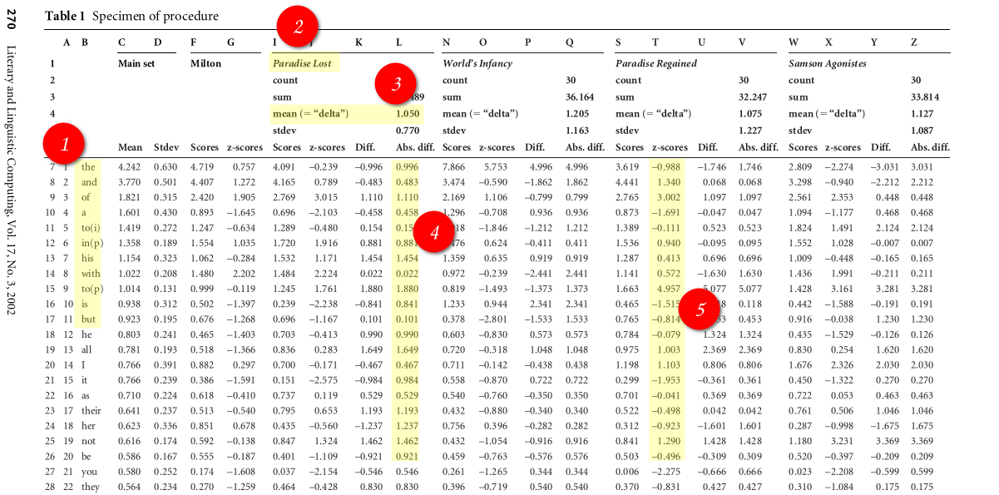


Source: 

https://doi.org/10.1093/llc/17.3.267

And by way of a surprise finding, I discovered that the Gutenberg corpus was awful in classifying the Satoshi texts. The Kindle dataset, being a much more recent collection of texts was much better at the task of reducing the candidates. I suspect that this is the case because the Gutenberg texts has older texts and the Kindle has much more newer texts. For this reason I was able to use Gut for reducing older say Biblical texts and Kin for the Satoshi problem. The Gut text has translated works such as Plato and Aristotle into English and so is well suited to Biblical texts. I used an anagram algorithm to discover any overlapping texts between Kin and Gut, thus removing them. For example, one dataset would have JaneAusten while the other would have AustenJane. A simple lowercase() and sorted() function can easily discover that these two texts are by the same author. And by the way, I suspect that some sort of purity measure, such as a gini coefficient, may prove useful and analyzing how useful a particular dataset is. For example, if a dataset is so awful that it classifies every author as the same then you can measure this and automatically select a better training set. This is just a thought for future research.  

I created 13 Forest models on an Amazon EC2 with character grams of 100 through to 1000 with gaps of 100 (10 models), and word grams of [100,200,300] (3 models). There were two words in the word grams that needed to be removed due to an error and so the 300 condition was really 298 (there was an empty string and a parsing error of 'ofthe' in the single word grams). I created 3 separate models for each condition being Kin, Gut, and a Combination of Gut/Kin. 

My findings during the reduce() stage was that two authors being Gavin Andresen (ID = 224) and Lachesis (ID = 237) were classified as Satoshi 9 times out of 13 for the Kin Random Forest models (3 word models and 10 4-gram character models). I then removed all texts under 4 classifications to complete the reduction process and to let Doxer analyze the texts with its unique word overlap algorithm. I analyzed character grams 4 through 10 (7 class) and word grams 1 through to 10 (10 class) on the Doxer algorithm, thus giving me 17 extra classifications. The results were quite definite as illustrated in the graph below with all but one classification going to Gavin. All character grams were given to Gavin and only the 10th word gram was given to Lachesis. Therefore, out of the top classified Random Forest candidates, Gavin Andresen had the most unique grams (character and word) with that of Satoshi Nakamoto! 

### Update 7/June/21
**I recently added Hal's posts and found that the Forest also added him to the reduced list. My top favorites of Satoshi now include Gavin, Hal, Lachesis (i.e. Eric Swanson). However, when I compare only Gavin, Hal, and Lachesis, Gavin wins.**

I further ran the reduced datasets over the rstylo library in R to see if I would get a similar result. Using 1,000 most frequent word models and also using both Forest texts above 4 classifications and all texts classified as Satoshi, I found that Gavin and Satoshi clustered together. It is interesting that even in the rstylo() cluster Lachesis was second best to Gavin, thus showing what a tight race it was indeed. 

Results of Doxer and RandomForest as to number of classifications as Satoshi: 

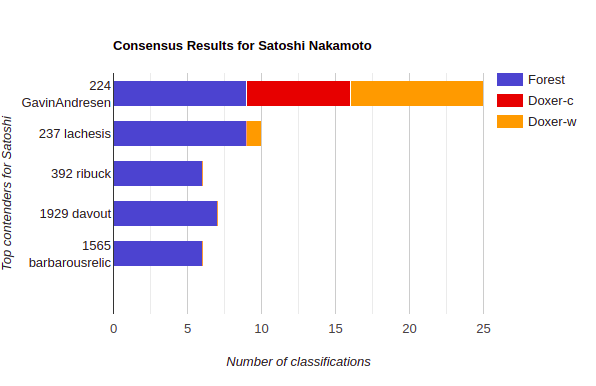


Results of rstylo library clustering all the texts classified by Forest as Satoshi: 


Results of rstylo library clustering only top texts above 4 Forest classifications: 

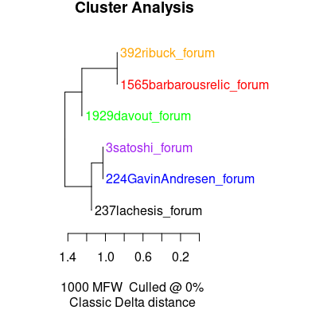


And here is the rstylo R package: 

https://github.com/computationalstylistics/stylo

## Benchmark

As one of the more important parts of stylometry, a benchmark allows you to see at a first glance whether the algorithm has any utility to it. I took the time to benchmark three separate collections, each in a different language. I'm actually really impressed with this algorithm so as to get a fair result on three separate languages. 


English Novels: 83% (possibly 85% once Anon/Blackmore are taken into account)

Russian Novels: 85.18%

Polish Novels: 85%


This was the result for `doxer.py -b -r 10` 


The other wonderful thing about these results is that the Doxer algorithm could achieve this with no training sets. Yes, that's right, Doxer is an unsupervised algorithm making it quite light and easily customized. I also performed a benchmark on the PAN2014 dataset (pictured below) but didn't go into too much depth with it. That may be a project for a future date but doesn't concern me much here because the PAN2014 has quite small samples and doesn't resemble the Satoshi problem. I was able to beat many sub-sets on PAN2014 when using a combined training set and calibration model. Again, there is such ample room for customizing and extending such a simple algorithm as Doxer. Be my guest and pull it apart!

Here are the links to the original benchmarks: 

https://github.com/computationalstylistics/100_polish_novels

https://github.com/computationalstylistics/100_english_novels

https://github.com/JoannaBy/RussianNovels


## Interpretability `\w*-\w*-\w*`

I actually came across this regex pattern with the infamous `back-of-the-envelope` word cluster. I was reading over pages upon pages of Satoshi and then suddenly, when tossing through Gavin's blogs, I noticed this cluster of words in a blog published months before Gavin joined the Bitcoin project. But this pattern drips in fact with the style of Bitcoin writings. Satoshi's identity is embedded in the very term `proof-of-work` or `proof-of-stake`. It is as if Gavin's fingerprints themselves are all over this fine piece of machinery!

Here are some other regex results that contain the same pattern. Let's start with Satoshi: 

	one-person-one-vote
	proof-of-work
	tit-for-tat
	non-lower-ascii
	stable-with-respect-to-energy
	side-by-side


Now let's see the pattern used by Gavin: 

	fee-per-kilobyte
	some-amount-per-1000-bytes-of-the-transaction
	zero-knowledge-proofs
	three-to-one
	btc-to-fiat
	tragedy-of-the-commons
	business-as-usual

And of course the infamous: 

	back-of-the-envelope


Can you spot the similarity here? There is a certain style of writing that goes along with the use of such word clusters. But don't just observe the words by themselves, have a look at where they are placed. While musing over the -o switch in the Doxer program, I noticed that Gavin is distinguished from many of the other authors due to the added punctuation in his words. There are so many of these word clusters that are given added weight on Gavin because he places them at the end of a sentence with a fat full stop appended to the end. It is this added feature that lets me know that Doxer is not just analyzing unique words but is also analyzing the unique grammar of an author. Yes, many of the Bitcoin developers have used the same word clusters as proof-of-work, but they still haven't used them in the very unique way in which their creator used them. 

So next time you see one of those most common word clusters like proof-of-work, just remember that there is a greater regex pattern going on here that has Satoshi's fingerprints all over them. But don't take my word for it. Please be my guest and look through the texts yourself. I have so graciously compiled a very nice collection of texts in the folder above (as no research on this matter has done yet). I actually encourage you to do your own analysis. Extend the field of stylometry by all means. I would simply love it in fact if I could simply clone someone else's Github page and conduct cutting edge stylometry from the comfort of my own Linux terminal!

### Update 7/June/21

**Gavin also performs well on patterns of multiple words in a row. He not only uses the term back-of-the-envelope, but also uniquely adds the words "rough" or "my" at the front in the same way that Satoshi does. There are hundreds of patterns like these that distinguish Gavin from other Satoshi-candidates.**

**Try it for yourself... download the Bitcoin forum folder above and type the following in terminal:**

	grep -l "My back-of-the-envelope" * 
	
**And then try:**

	grep -l "rough back-of-the-envelope" * 
	
**Can you see the results? I'll print them out for you in case you haven't. Both commands in bash return the same result:**

	224GavinAndresen_forum.txt
	3satoshi_forum.txt
	
**That's right, out of 620 profiles from the BitcoinTalk Forum, only two people used these word combinations. That's 63.4 MB of text where only two profiles pop out as using this phrase. It just so happens that Stylometric analysis also isolates these two profiles as of haivng the same writing style. That's Stylometric analysis on function word use (i.e. frequency patterns of words like "the","but","then") and also unique word useage (i.e. Doxer).**

You can check out the use of this phrase in the wild on the BitcoinTalk forum:

Satoshi's use of the phrase:
https://bitcointalk.org/index.php?action=profile;u=3;sa=showPosts;start=460

Gavin's use of the phrase:
https://bitcointalk.org/index.php?action=profile;u=224;sa=showPosts;start=200

And here are some screenshots of the phrase:

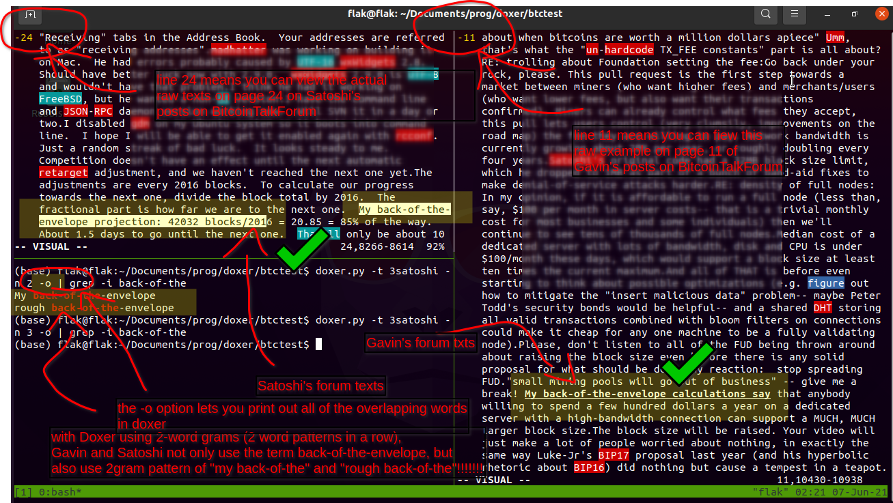

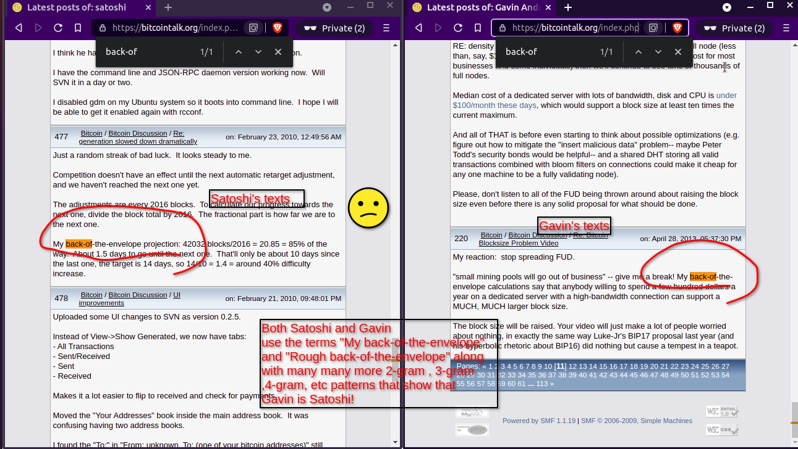

## Consensus

And by way of my own rather rough form of back-of-the-envelope analysis, I couldn't help but peer inside the mysteries of the Bible texts and see if I could solve a mystery or two. I particularly wanted to find out the author of the q-source gospel, the supposed original gospel of the new testament. In addition to this I wanted to test out the Septuagint priority theory that most of the old testament was written around or after the Septuagint translation. I reasoned to myself in a rather crude way that the priority would be supported if I found an earlier text of the Bible, let's say Genesis, loaded with a latter book such as Daniel or Tobit. What I found was quite impressive because it seems that even the simplest of models could handle this case. The book of Genesis has in fact a similar writing style to Kings I through to IV, but better yet, a salient similarity to that of Daniel! The R library rstylo in fact clusters Daniel and Genesis together even with all of the other LXX (Septuagint) books present. And if you read the books of Genesis and Daniel together you may notice that they have similar words and stories--both delve deeply into the world of dream interpretation, probably even a precursor or inspiration for the late Sigmund Freud. But have you ever noticed how similar Daniel is to Joseph (a character in Genesis). They both interpreted terrifying dreams of the king and were given a nice gold necklace to adorn their necks. I also noticed that with the Septuagint version, and surviving in texts such as the King James Bible, that both Daniel and Genesis used the word firmament, a possible indication as to the cosmology of the writer. 


Moving right along to the q-source gospel, I must say that I was deeply disappointed with my findings because it disproved a theory of mine that James the Just wrote the q-source. I had to face up to the facts when both the Forest and Doxer nearly completely ignored the James texts and instead, nearly in every single model, classified the Gospel of Thomas as the same author as the long lost q-source gospel. The finding was extremely robust and I had no choice but to accept the findings and drop James for probably ever more. In a rather interesting way, both testaments have a theoretical background in Greek philosophy. The possible Hellenistic origins of the old testament and the gnostic (i.e. middle Platonism) of Thomas are a clear indication that there is a Greek context to both old and new testaments. I chuckle to myself thinking about  my fundamentalist upbringing where Christmas, Easter, and Birthdays were all banned simply because they had origins in Greek and Roman festivities. To be quite frank, I cannot understand it for the life of me as to why anyone would hold such contempt for Greek culture and philosophy. If you were to ask me I think it is our birth right in the west to know of where our culture comes from and where we may be going as a result. Well I hope Doxer has solved all of these mysteries once and for all, but I'm quite sure a lot more work will need to be done on the matter. 


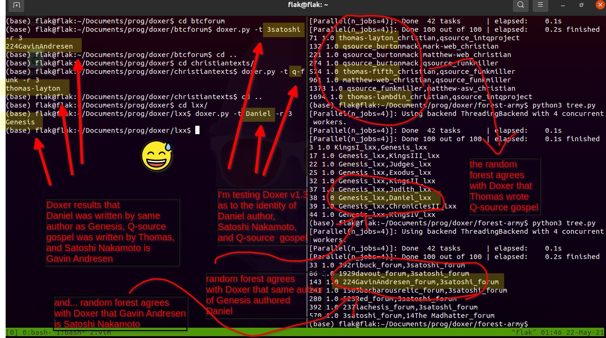


Here are some interesting books that you can read on the matter while maybe also by chance running Doxer on the side:


The Gospel of Thomas and Plato

By Ivan Miroshnikov

https://brill.com/view/title/38096?language=en


Plato and the Creation of the Hebrew Bible

By Russell E. Gmirkin

https://www.routledge.com/Plato-and-the-Creation-of-the-Hebrew-Bible/Gmirkin/p/book/9780367878368


## Systematic Bias

One of the very reasons why I chose to analyze the Bitcoin forums is that it holds a rare chance in stylometry to perform what amounts to a controlled scientific experiment. I'm not sure whether stylometry could ever be one hundred percent scientific, but I regard the goal in of itself a worthy one to strive for. What I really love about the Bitcoin forums is that they have a large chunk of texts, volumes in fact, of people discussing matters in the same genre without any interruption. There is no, for example, deviation by way of writing fan fiction or publishing some long winded blog. Everything in the forum is tightly constrained to the topic of Bitcoin and cryptocurrency in general. For this reason a true stylometry measurement can be had by focusing on the differences only within this closed community. I hold this current research to be a valuable contribution to the field of stylometry for this reason and hold these results to be more pure then other textual comparisons that compare texts from a variety of sources. Even that of a blog site being compared to a forum is an example of a vastly different genre. 

When using the datasets I've provided, please remember that the author is often held at the front before the title of the book. However, I have changed it slightly so that the file Gorky-Mat_russian.txt means that the authorship text includes Gorky- and Mat as the algorithm splits at the `_` mark. If you don't have every author as a unique string then the program will crash. This is why this is important. 

The Forum corpus contains substantial texts between IDs 1 and 2000. I also included Adam Back simply because many people have suggested his authorship. When I say substantial I mean anything over one page of texts and with a valid ID. The filename 3satoshi_forum.txt means that the profile name is satoshi, while the ID is 3. One can access the raw data by visiting the html link as follows: 


https://bitcointalk.org/index.php?action=profile;u=3


The profile of Gavin Andresen is 224 which can be accessed here: 

https://bitcointalk.org/index.php?action=profile;u=224


As you can probably guess the u=3 and u=224 can be replaced with any ID that you may wish to look up so as to explore the actual texts in their original form. 

On a note about the validity of the Kin and Gut Forest models. They both had cross validity between one another at around 83% accuracy. Given that they have vastly different styles of texts being old and new, it is quite a testament to the Forest model that it is able to still find a high level of accuracy nevertheless. 

And on an extra note about the double space pattern associated with Adam Back. My simple response is that Gavin Andresen also had this pattern of two spaces after full stops in the early days of his forum posts. I don't know exactly what this pattern means but it seems many early forum posts had this pattern. Maybe it is a software feature? I have included a picture of the phenomena in Gavin's early posts down below.  

## Interpretability++ 


### back-of-the-envelope and double-spacing!


### non-obvious example of Satoshi
Other Bitcoin developers use this word, but in the reduced list, Gavin only uses it. 

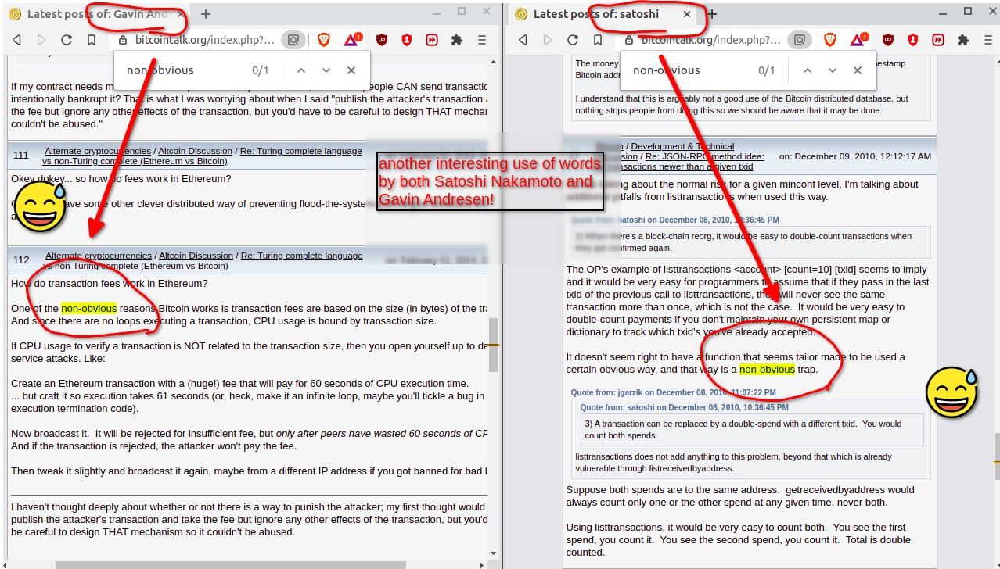


### double-spacing pattern 

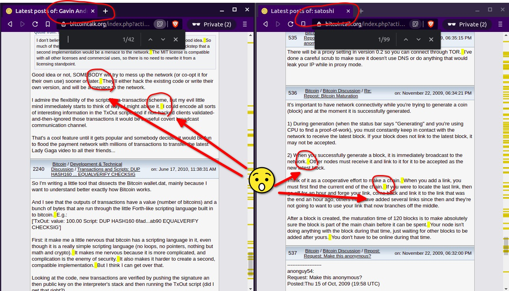


### Blackmore and Clara finding


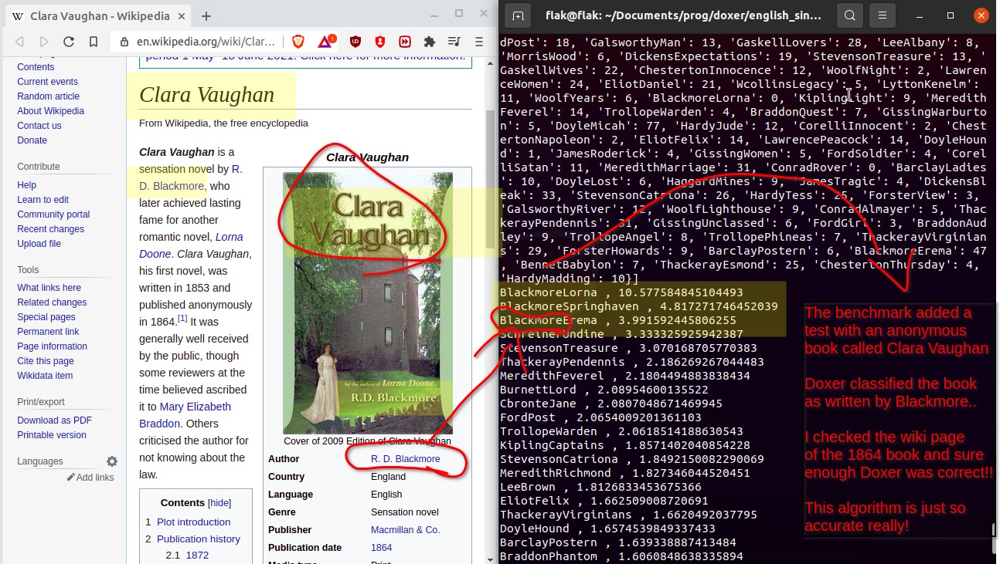


### Dream Interpretation 


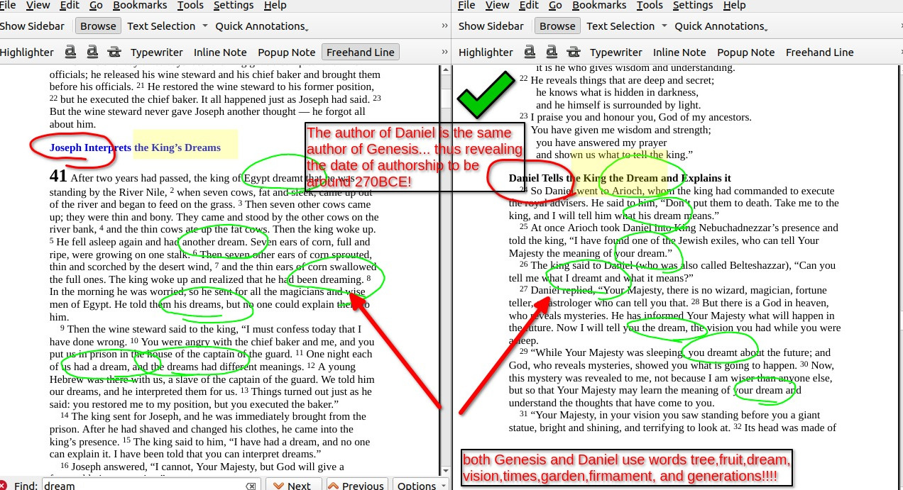


### PAN2014 Benchmark Results (not complete yet)


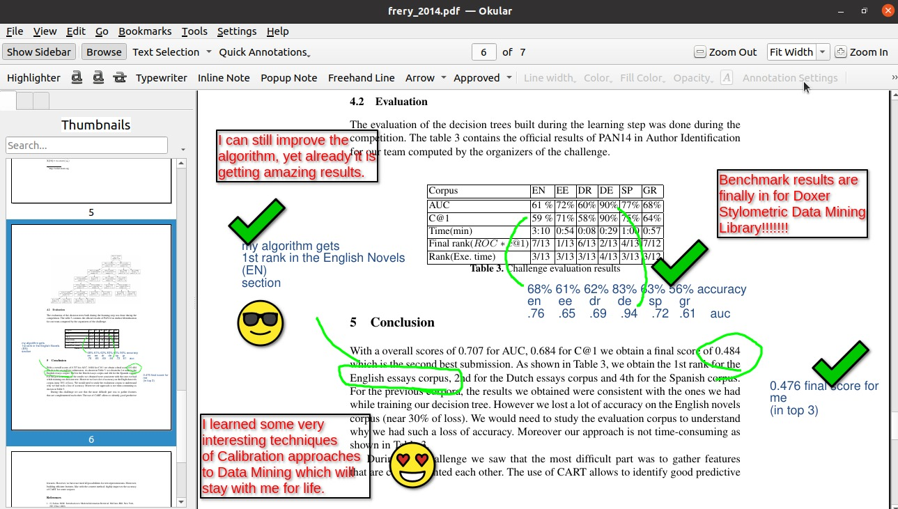


# Working out

## Doxer Results after using word gram Forest reduction:
1. Note that nearly *all* of the results declare Gavin the winner.
2. Also note that on the word gram forests, both Gavin and Hal are classified 2/3 times.
3. The reduced list is from a folder of 600 profiles and reduces them down to a small number. 

```python
Running over all Forest models
--------------------------------------
56 1.0 ['2436Hal_forum', '3satoshi_forum']
56 1.0 ['2436Hal_forum', '3satoshi_forum']
59 1.0 ['1783Artefact2_forum', '3satoshi_forum']
144 1.0 ['224GavinAndresen_forum', '3satoshi_forum']
179 1.0 ['1171btchris_forum', '3satoshi_forum']
219 1.0 ['517BeeCee1_forum', '3satoshi_forum']
16 1.0 ['526Olipro_forum', '3satoshi_forum']
144 1.0 ['224GavinAndresen_forum', '3satoshi_forum']
276 1.0 ['597omegadraconis_forum', '3satoshi_forum']
301 1.0 ['511Bitquux_forum', '3satoshi_forum']
369 1.0 ['469eugene2k_forum', '3satoshi_forum']
372 1.0 ['1168puddinpop_forum', '3satoshi_forum']
434 1.0 ['3satoshi_forum', '357EricJ2190_forum']
498 1.0 ['3satoshi_forum', '466lfm_forum']
508 1.0 ['3satoshi_forum', '479PulsedMedia_forum']
578 1.0 ['3satoshi_forum', '1567doublec_forum']
609 1.0 ['3satoshi_forum', '576Syke_forum']

Reduced list of forest candidates:
--------------------------------------
[[17, '3satoshi_forum'], [2, '2436Hal_forum'], [2, '224GavinAndresen_forum'], [1, '597omegadraconis_forum'], [1, '576Syke_forum'], [1, '526Olipro_forum'], [1, '517BeeCee1_forum'], [1, '511Bitquux_forum'], [1, '479PulsedMedia_forum'], [1, '469eugene2k_forum']]

Analyzing Word Grams 1 - 10
--------------------------------------
1 224GavinAndresen
2 224GavinAndresen
3 224GavinAndresen
4 224GavinAndresen
5 224GavinAndresen
6 597omegadraconis
7 224GavinAndresen
8 224GavinAndresen
9 224GavinAndresen

Analyzing Char Grams 4 - 10
--------------------------------------
4 224GavinAndresen
5 224GavinAndresen
6 224GavinAndresen
7 224GavinAndresen
8 224GavinAndresen
9 224GavinAndresen
```

## Doxer results on character n-gram built forest reduction
1. There are more classifications because there are 10 different forest models. 
2. Gavin wins again overall, yet faces competition from Hal. 
3. It is of interest that Hal has such a similar writing style as that of Satoshi. 
4. Also worth noticing is that Lachesis wasn't found in the word gram models previous, but is found in the character gram models. 

```python
Running over all Forest models
--------------------------------------
14 1.0 ['413bg002h_forum', '3satoshi_forum']
33 1.0 ['392ribuck_forum', '3satoshi_forum']
56 1.0 ['2436Hal_forum', '3satoshi_forum']
87 1.0 ['1929davout_forum', '3satoshi_forum']
214 1.0 ['541jgarzik_forum', '3satoshi_forum']
242 1.0 ['1565barbarousrelic_forum', '3satoshi_forum']
281 1.0 ['525Red_forum', '3satoshi_forum']
393 1.0 ['237lachesis_forum', '3satoshi_forum']
450 1.0 ['3satoshi_forum', '535em3rgentOrdr_forum']
490 1.0 ['3satoshi_forum', '1496Bimmerhead_forum']
501 1.0 ['3satoshi_forum', '491kiba_forum']
572 1.0 ['3satoshi_forum', '14The Madhatter_forum']
599 1.0 ['3satoshi_forum', '704caveden_forum']
33 1.0 ['392ribuck_forum', '3satoshi_forum']
56 1.0 ['2436Hal_forum', '3satoshi_forum']
87 1.0 ['1929davout_forum', '3satoshi_forum']
144 1.0 ['224GavinAndresen_forum', '3satoshi_forum']
242 1.0 ['1565barbarousrelic_forum', '3satoshi_forum']
281 1.0 ['525Red_forum', '3satoshi_forum']
393 1.0 ['237lachesis_forum', '3satoshi_forum']
572 1.0 ['3satoshi_forum', '14The Madhatter_forum']
33 1.0 ['392ribuck_forum', '3satoshi_forum']
87 1.0 ['1929davout_forum', '3satoshi_forum']
144 1.0 ['224GavinAndresen_forum', '3satoshi_forum']
281 1.0 ['525Red_forum', '3satoshi_forum']
393 1.0 ['237lachesis_forum', '3satoshi_forum']
599 1.0 ['3satoshi_forum', '704caveden_forum']
14 1.0 ['413bg002h_forum', '3satoshi_forum']
33 1.0 ['392ribuck_forum', '3satoshi_forum']
56 1.0 ['2436Hal_forum', '3satoshi_forum']
87 1.0 ['1929davout_forum', '3satoshi_forum']
144 1.0 ['224GavinAndresen_forum', '3satoshi_forum']
214 1.0 ['541jgarzik_forum', '3satoshi_forum']
242 1.0 ['1565barbarousrelic_forum', '3satoshi_forum']
364 1.0 ['198allinvain_forum', '3satoshi_forum']
393 1.0 ['237lachesis_forum', '3satoshi_forum']
498 1.0 ['3satoshi_forum', '466lfm_forum']
56 1.0 ['2436Hal_forum', '3satoshi_forum']
87 1.0 ['1929davout_forum', '3satoshi_forum']
144 1.0 ['224GavinAndresen_forum', '3satoshi_forum']
219 1.0 ['517BeeCee1_forum', '3satoshi_forum']
242 1.0 ['1565barbarousrelic_forum', '3satoshi_forum']
599 1.0 ['3satoshi_forum', '704caveden_forum']
33 1.0 ['392ribuck_forum', '3satoshi_forum']
56 1.0 ['2436Hal_forum', '3satoshi_forum']
87 1.0 ['1929davout_forum', '3satoshi_forum']
242 1.0 ['1565barbarousrelic_forum', '3satoshi_forum']
364 1.0 ['198allinvain_forum', '3satoshi_forum']
393 1.0 ['237lachesis_forum', '3satoshi_forum']
599 1.0 ['3satoshi_forum', '704caveden_forum']
33 1.0 ['392ribuck_forum', '3satoshi_forum']
41 1.0 ['4sirius_forum', '3satoshi_forum']
56 1.0 ['2436Hal_forum', '3satoshi_forum']
87 1.0 ['1929davout_forum', '3satoshi_forum']
242 1.0 ['1565barbarousrelic_forum', '3satoshi_forum']
393 1.0 ['237lachesis_forum', '3satoshi_forum']
476 1.0 ['3satoshi_forum', '336Insti_forum']
14 1.0 ['413bg002h_forum', '3satoshi_forum']
55 1.0 ['270llama_forum', '3satoshi_forum']
56 1.0 ['2436Hal_forum', '3satoshi_forum']
144 1.0 ['224GavinAndresen_forum', '3satoshi_forum']
393 1.0 ['237lachesis_forum', '3satoshi_forum']
56 1.0 ['2436Hal_forum', '3satoshi_forum']
144 1.0 ['224GavinAndresen_forum', '3satoshi_forum']
393 1.0 ['237lachesis_forum', '3satoshi_forum']
56 1.0 ['2436Hal_forum', '3satoshi_forum']
144 1.0 ['224GavinAndresen_forum', '3satoshi_forum']
393 1.0 ['237lachesis_forum', '3satoshi_forum']

Reduced list of forest candidates:
--------------------------------------

[[68, '3satoshi_forum'], [9, '2436Hal_forum'], [9, '237lachesis_forum'], [7, '224GavinAndresen_forum'], [7, '1929davout_forum'], [6, '392ribuck_forum'], [6, '1565barbarousrelic_forum'], [4, '704caveden_forum'], [3, '525Red_forum'], [3, '413bg002h_forum']]

Analyzing Word Grams 1 - 10
--------------------------------------
1 224GavinAndresen
2 224GavinAndresen
3 224GavinAndresen
4 237lachesis
5 2436Hal
6 2436Hal
7 2436Hal
8 2436Hal
9 2436Hal

Analyzing Char Grams 4 - 10
--------------------------------------
4 224GavinAndresen
5 224GavinAndresen
6 224GavinAndresen
7 224GavinAndresen
8 224GavinAndresen
9 224GavinAndresen
```

## Doxer results just comparing Satoshi, Gavin, Hal, and Lachesis
1. This may seem repetitive, but it is worth noting that when the top contenders are compared with no other texts, that Gavin is more similar to Satoshi. 

```python
Analyzing Word Grams 1 - 10
--------------------------------------
1 224GavinAndresen
2 224GavinAndresen
3 224GavinAndresen
4 224GavinAndresen
5 224GavinAndresen
6 224GavinAndresen
7 224GavinAndresen
8 224GavinAndresen
9 224GavinAndresen

Analyzing Char Grams 4 - 10
--------------------------------------
4 224GavinAndresen
5 224GavinAndresen
6 224GavinAndresen
7 224GavinAndresen
8 224GavinAndresen
9 224GavinAndresen
```


